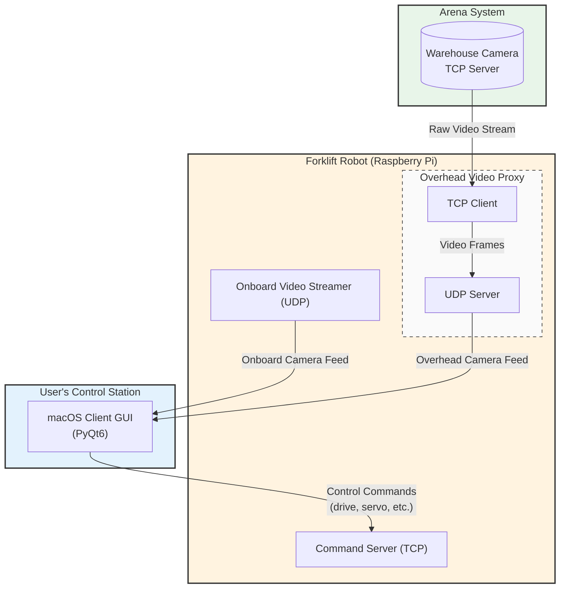

# Remote-Controlled Forklift - ELEX 4699 Project

## Executive Summary

This project is a remote-controlled forklift designed for a package-sorting competition at the British Columbia Institute of Technology (BCIT). Controlled by a Raspberry Pi and operated via a custom macOS application, the robot successfully achieved a perfect grade of 100%. Our key achievement was a teleoperated run where we delivered 16 packages in 2.5 minutes, the highest score in the class. The robot features a unique 2x3 fork array, allowing it to carry up to six packages simultaneously. The software for this project was developed using an AI-augmented workflow, with a conversational AI agent generating the Python code for the client-server architecture, hardware control, and computer vision.

## Project Overview

This repository contains the code and documentation for the forklift, a project for BCIT's ELEX 4699 course. The objective was to design and build a robot to solve a package-sorting challenge within a 4-foot square arena. The project was completed over a 4-week period by Braden Vanderwoerd and Jacob Edwards.

Interestingly, every document in this repository (excluding this README) was generated entirely by a conversational AI coding assistant, showcasing a modern development workflow.

## The Challenge

The challenge involved transporting packages from pickup shelves to corresponding drop-off shelves.

*   **Arena:** A 4-foot square area containing two pickup shelves and two drop-off shelves. The arena was monitored by an overhead camera accessible via a TCP server.
*   **Packages:** White and black boxes (24 total) were arranged on three levels of the pickup shelves. Packages had ArUco markers on their faces and magnets on their backs to assist with alignment and drop-off.
*   **Arrangement Rules:** Each level of the pickup shelves held two white and two black boxes. The arrangement on each level was unique.
*   **Objective:** In a 2.5-minute run, deliver as many white boxes to the white drop-off shelf and black boxes to the black drop-off shelf as possible.
*   **Constraints:** The robot's size was limited by a starting box in the arena, and it was required to use a Raspberry Pi as its main control unit.

## Our Solution

Our strategy was to maximize the number of boxes delivered per trip. We designed a robot with a 2x3 array of forks on the front, allowing it to transport up to six boxes at once. Given the initial arrangement rules, this design allowed for transporting a maximum of four same-coloured boxes per trip.

_Add a picture of the robot here! e.g., ``_

The robot was built on a two-wheel drive chassis with front motors and a rear ball caster, providing smooth and precise motion centered around the fork mechanism.

### Hardware

*   **Compute:** Raspberry Pi 4, powered by a standard portable USB charger.
*   **Actuation:** An L293N driver controlled two DC motors for movement. Six servos, powered via the Raspberry Pi's 5V GPIO pins, actuated the forks.
*   **Chassis:** The chassis and fork system were custom-designed in Solidworks and 3D printed.
*   **Vision:** An onboard camera was strategically mounted to align with a single fork, ensuring that if one box was aligned correctly, the others would naturally seat onto their respective forks.

### Software Architecture

The project's software was developed in Python using the Cursor IDE and its integrated AI agent. This approach significantly accelerated the coding and iteration process.

*   **Server (Raspberry Pi):**
    *   A central TCP server to receive and process teleoperation commands from the client.
    *   A UDP server to stream video from the robot's onboard camera.
    *   A client/server pair to receive the overhead arena camera feed (via TCP) and re-stream it (via UDP) to the control application. This centralized all data streams through the robot.

*   **Client (macOS Application):**
    *   A custom GUI built with PyQt6 for user control and video display.
    *   Connects to all three data streams from the Raspberry Pi server.
    *   Features UI elements for driving, operating the forks, and viewing both camera feeds simultaneously.

## Getting Started

For detailed setup and installation instructions, please see [INSTALL.md](INSTALL.md).

## Final Result & Grading

The project was graded on a series of milestones and live demonstrations. We successfully achieved the Week 1 (one teleoperation delivery) and Week 4 (custom PCB) milestones, securing an initial 30%.

Our teleoperation strategy proved highly effective. After an initial successful run, we refined our approach for a final attempt. In that run, we successfully delivered 16 boxes, earning 85% for the run and achieving the **class high score for teleoperation**. This was added to the milestone grade and brought our final project grade to a perfect **100%**.

## Future Work: Autonomous Mode

The project's grading scheme offered multiple paths to achieve a perfect score. While autonomous deliveries were worth double the points of teleoperated ones, it was also possible to reach 100% by excelling in the teleoperation category and completing all project milestones. We therefore made the strategic decision to focus our efforts on a high-scoring teleoperation run.

Even so, we built a robust foundation for autonomous operation to demonstrate the project's scalability. The plan involved using an ArUco marker mounted on the robot, visible to the overhead camera, for localization. A PID control loop was implemented to navigate the robot to preset coordinates within the arena for pickup and drop-off. The core logic exists in the codebase but requires significant calibration and tuning to be competition-ready. This foundational work demonstrates that the system was designed with future automation in mind.

